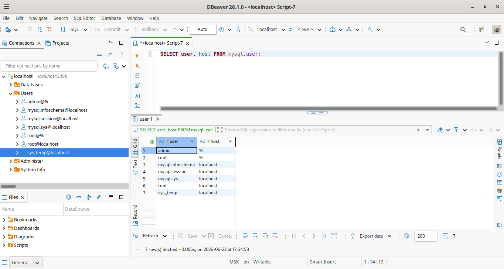
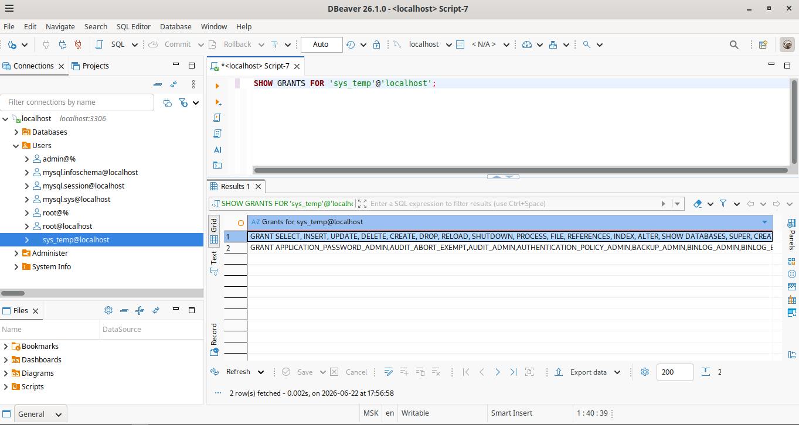
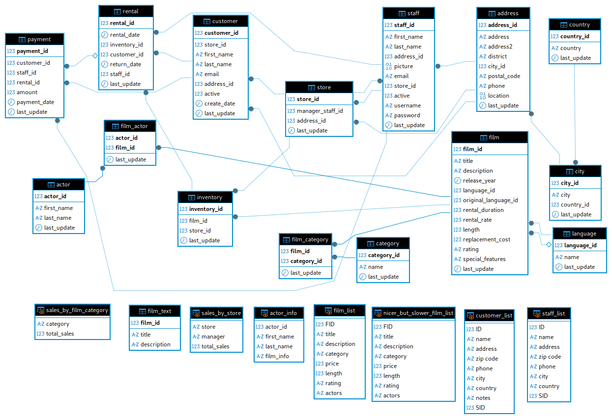
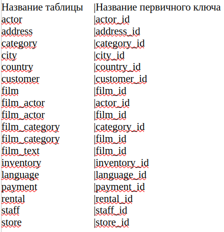
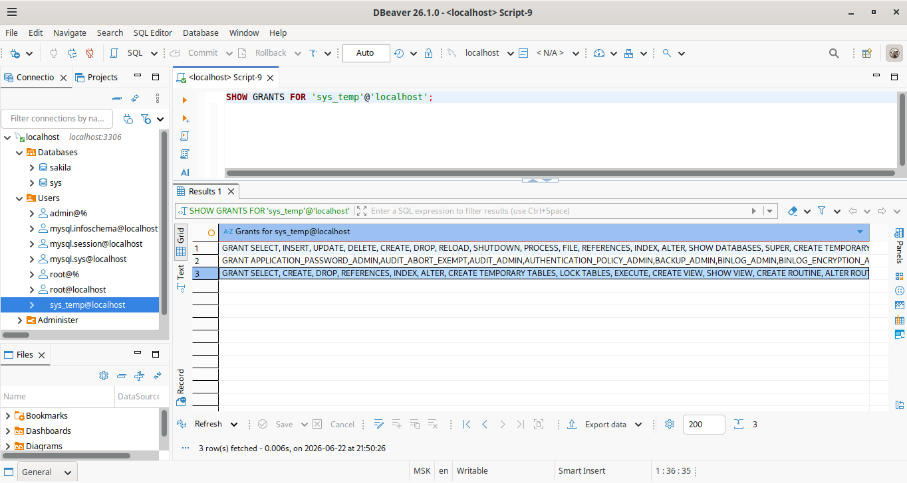

# Домашнее задание к занятию "Работа с данными (DDL/DML)" - Сергеев Александр


### Инструкция по выполнению домашнего задания

   1. Сделайте `fork` данного репозитория к себе в Github и переименуйте его по названию или номеру занятия, например, https://github.com/имя-вашего-репозитория/git-hw или  https://github.com/имя-вашего-репозитория/7-1-ansible-hw).
   2. Выполните клонирование данного репозитория к себе на ПК с помощью команды `git clone`.
   3. Выполните домашнее задание и заполните у себя локально этот файл README.md:
      - впишите вверху название занятия и вашу фамилию и имя
      - в каждом задании добавьте решение в требуемом виде (текст/код/скриншоты/ссылка)
      - для корректного добавления скриншотов воспользуйтесь [инструкцией "Как вставить скриншот в шаблон с решением](https://github.com/netology-code/sys-pattern-homework/blob/main/screen-instruction.md)
      - при оформлении используйте возможности языка разметки md (коротко об этом можно посмотреть в [инструкции  по MarkDown](https://github.com/netology-code/sys-pattern-homework/blob/main/md-instruction.md))
   4. После завершения работы над домашним заданием сделайте коммит (`git commit -m "comment"`) и отправьте его на Github (`git push origin`);
   5. В личном кабинете прикрепите и отправьте ссылку на решение в виде md-файла в вашем Github.
   6. Любые вопросы по выполнению заданий спрашивайте в разделе “Вопросы по заданию” в личном кабинете.
   
Желаем успехов в выполнении домашнего задания!
   
### Дополнительные материалы, которые могут быть полезны для выполнения задания

1. [Руководство по оформлению Markdown файлов](https://gist.github.com/Jekins/2bf2d0638163f1294637#Code)

---

### Задание 1

1. Развернул сервер БД MySQL версии 8.0.36 в контейнере Docker compose.
2. Используя DBeaver, подключился к серверу MySQL с администраторской учетной записью и создал учётную запись sys_temp.
3. Выполнил запрос на получение списка пользователей в базе данных:



4. Дал все права учетной записи sys_temp.
5. Выполнил запрос на получение списка прав для учетной записи sys_temp:



6. Изменил тип аутентификации учетной записи sys_temp с sha2 на парольную запросом:
```
ALTER USER 'sys_test'@'localhost' IDENTIFIED WITH mysql_native_password BY '12345';
```
Переподключился к базе данных от имени sys_temp.
7. По ссылке скачал дамп базы данных.
8. Создал пустую БД и восстановил в нее дамп (скрипты sakila-schema.sql и затем sakila-data.sql).
9. Сформировал ER-диаграмму получившейся базы данных:



---

### Задание 2

Изучил структуру таблиц восстановленной БД sakila и составил список из двух столбцов:
Название таблицы и Название первичного ключа таблицы. 



---

### Задание 3*

1. Отозвал у учетной записи sys_temp права на внесение, изменение и удаление данных из базы sakila.
2. Выполнил запрос на получение списка прав для пользователя sys_temp:


